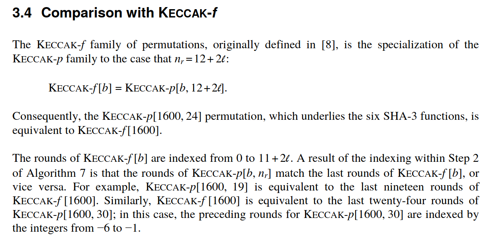
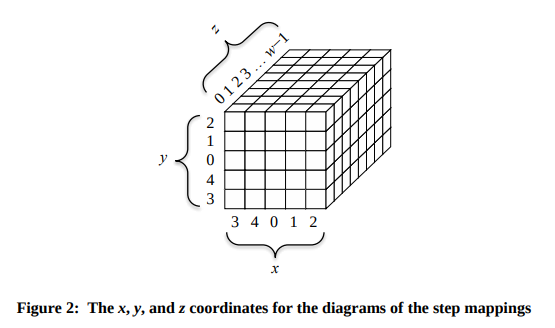
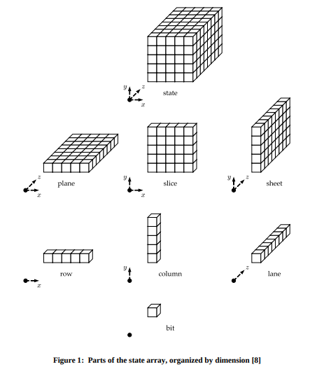
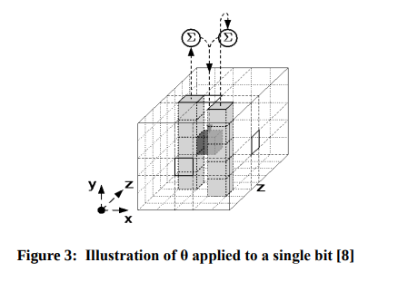
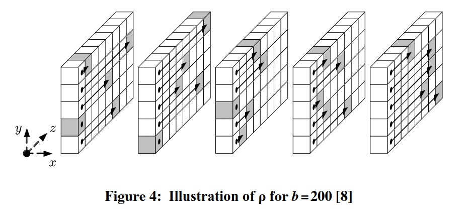
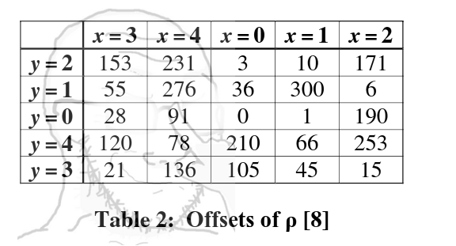

# Keccak, SHA-3, and SHAKE-N algorithms explained, with code in Erlang

![I can't make a diagram for this one, fellas.[^sponge]](./sponge.jpg)

## Contents

-   [Introduction](#introduction)
-   [tldr](#tldr)
    -   [References](#references)
    -   [Pitfalls](#pitfalls)
        -   [Pitfall: This is only keccak-f-1600](#pitfall-this-is-only-keccak-f-1600)
        -   [Pitfall: "fast keccak" versus "clear keccak"](#pitfall-fast-keccak-versus-clear-keccak)
        -   [Pitfall: "NIST SHA-3" versus "Keccak SHA-3"](#pitfall-nist-sha3-versus-keccak-sha-3)
        -   [Pitfall: SHAKE-N versus SHA3-N](#pitfall-shake-n-versus-sha3-n)
        -   [Pitfall: Greek letter steps require two copies of the sponge to compute](#pitfall-greek-letter-steps-require-two-copies-of-the-sponge-to-compute)
-   [SHA-s and SHAKE-s](#sha-s-and-shake-s)
-   [Outer Keccak](#outer-keccak)
    -   [Outer Keccak: Padding](#outer-keccak-padding)
    -   [Outer Keccak: Absorption phase](#outer-keccak-absorption-phase)
    -   [Outer Keccak: Squeezing phase](#outer-keccak-squeezing-phase)
-   [Inner Keccak: the kek operation](#inner-keccak-the-kek-operation)
    -   [Inner Keccak: theta stage](#inner-keccak-theta-stage)
    -   [Inner Keccak: rho stage](#inner-keccak-rho-stage)
    -   [Inner Keccak: pi stage](#inner-keccak-pi-stage)
    -   [Inner Keccak: chi stage](#inner-keccak-chi-stage)
    -   [Inner Keccak: iota stage](#inner-keccak-iota-stage)
    -   [Inner Keccak: coordinate-system](#inner-keccak-coordinate-system)


## Introduction

Keccak is a hashing algorithm used for the SHA-3 standard. [The NIST
standard][nist-standard] is semi-readable math clownery. Hashing algorithms by
nature have to be complicated and somewhat obfuscated, so this is kind of par
for the course.

I found [this lecture][german-lecture] and the [accompanying
notes][german-lecture-notes] indispensable when writing kek.

At the end of the day, all Keccak does is take in some input bits, process them
in a deterministic way, and hand you output bits.

The goal of this document is just to explain what the processing steps are as
straightforwardly as possible.

Keccak is the "general case", and then SHA-3 and SHAKE-128 and so on are
special cases of Keccak.

## tldr

- [Erlang code (clear)](https://github.com/pharpend/kek/blob/8a8a655a80c26ae32763cc25f1e0df8ab0653c82/kek.erl)
- [Erlang code (fast)](https://github.com/pharpend/kek/blob/8a8a655a80c26ae32763cc25f1e0df8ab0653c82/kek_fast.erl)
- [erlang-sha3 library (uses fast version of kek)](https://github.com/zxq9/erlang-sha3/blob/63193654e3c05d8031300ffcd52092f75e8b5c2f/src/sha3.erl#L85-L112)

### References

1. [Helpful lecture][german-lecture]
2. [Notes for that lecture][german-lecture-notes]
3. [NIST standard][nist-standard] (btw: the double bar notation means "concatenate")
4. [SHA-3 Wikipedia](https://en.wikipedia.org/wiki/SHA-3)

### Pitfalls

#### Pitfall: This is only keccak-f-1600

Keccak has an "outer keccak" and an "inner keccak".  The standard specifies
this free parameter called `b`, which is the bit size of the algorithm's state.
For what I needed, this can be assumed to be `1600`.  You may need to
generalize this code.  Hopefully this explainer is clear enough that you can do
that.




#### Pitfall: "fast keccak" versus "clear keccak"

The main reference is the "clear" Erlang code.  The "fast" version is the
"clear" version with optimizations applied.  The fast version was written by
Hans Svensson.

In particular, fast keccak is arity 4, and clear keccak is arity 3.

There are a couple of trivial differences in code structure, so when you're
reading code, you need to keep in mind which version you're looking at. When I
have a code sample, I will link the GitHub permalink in a comment where the
code originates from, so there shouldn't be any confusion.

```erlang
%% From "clear keccak"
%% https://github.com/pharpend/kek/blob/8a8a655a80c26ae32763cc25f1e0df8ab0653c82/kek.erl#L155-L159
-spec keccak(Capacity, Message, OutputBitLength) -> Digest
    when Capacity        :: pos_integer(),
         Message         :: bitstring(),
         OutputBitLength :: pos_integer(),
         Digest          :: bitstring().

%% From "fast Keccak"
%% https://github.com/pharpend/kek/blob/8a8a655a80c26ae32763cc25f1e0df8ab0653c82/kek_fast.erl#L142-L147
-spec keccak(Capacity, Message, Delimiter, OutputBitLength) -> Digest
    when Capacity        :: pos_integer(),
         Message         :: bitstring(),
         Delimiter       :: bitstring(),
         OutputBitLength :: pos_integer(),
         Digest          :: bitstring().
```

The reason for this is one of Hans's optimizations was speeding up the manner
in which padding was applied, and that required factoring it out into an
argument.

#### Pitfall: "NIST SHA-3" versus "Keccak SHA-3"

There are two versions of "SHA-3".  There's the "NIST version" and the "keccak
version".  The only difference is that NIST adds two bits (yes bits, not bytes)
of padding

```erlang
%% From the erlang-sha3 lib, which uses the fast version
%% - ignore the capacity and what not for now, will be explained in a minute
%% - OutputBitLength is the N in SHA3-N. So it would be 512 for SHA3-512, 256
%%   for SHA3-256, etc.
%% - Message is the input bitstring to be hashed

%% https://github.com/zxq9/erlang-sha3/blob/63193654e3c05d8031300ffcd52092f75e8b5c2f/src/sha3.erl#L107-L112
kek(OutputBitLength, Message, keccak) ->
    Capacity = 2 * OutputBitLength,
    keccak(Capacity, Message, <<>>, OutputBitLength);
                          %%  ^ keccak sha3 adds no padding bits
kek(OutputBitLength, Message, nist) ->
    Capacity = 2 * OutputBitLength,
    keccak(Capacity, Message, <<2#01:2>>, OutputBitLength).
                          %%  ^ nist sha3 concats these padding bits to the end of Message
```

The reason this problem exists is the "keccak version" was used in production
code before the NIST standard was published. So now there are two versions
of "SHA-3" out there.

#### Pitfall: SHAKE-N versus SHA3-N

Note that the padding and sha3-is-keccak-but-its-not pitfall only applies to
the SHA-3 fixed-length hashing functions. These produce a fixed-length (say,
512 bit) hash.

The SHAKE-N algorithms are sort of "arbitrary length SHA-3". So instead of
producing 512 bits, you tell it how long the output length should be.  The
SHAKE-N algorithms have their own padding rule, and I don't believe they're
affected by the padding thing.

```erlang
%% From the "clear" version
%% The clear version was written against the NIST standard

%% https://github.com/pharpend/kek/blob/8a8a655a80c26ae32763cc25f1e0df8ab0653c82/kek.erl#L86-L89
sha3(OutputBitLength, Message) ->
    Capacity = 2*OutputBitLength,
    %% SHA-3 NIST padding is used in the clear version
    ShaMessage = <<Message/bitstring, (2#01):2>>,
    keccak(Capacity, ShaMessage, OutputBitLength).

%% https://github.com/pharpend/kek/blob/8a8a655a80c26ae32763cc25f1e0df8ab0653c82/kek.erl#L131-L134
shake(ShakeNumber, Message, OutputBitLength) ->
    Capacity = 2*ShakeNumber,
    %% SHAKE has its own padding rule
    ShakeMessage = <<Message/bitstring, (2#1111):4>>,
    keccak(Capacity, ShakeMessage, OutputBitLength).
```

#### Pitfall: Greek letter steps require two copies of the sponge to compute

This is the pitfall I ran into, and it stalled this project for months. I
couldn't figure out what the issue was, and the project was only saved because
Hans took the time to figure out the issue and fix it. The nature of hashing
algorithms is that they are all-or-nothing and are hard to decompose.  Usually
when your code doesn't work, you can do some trial and error to figure out
which part of the code is wrong.  Not so with hashing.

This algorithm has state, which is a 1600-bit bit array called the "sponge".
And that state gets updated a lot.  The updating procedure involves a lot of
`xor`ing this bit against that bit, and computing the parity of this string of
bits, etc.

A lot of it involves crawling down the bit array one bit at a time, and xoring
the current bit against certain bits from **the original bit array**, and then
keeping a separate copy that has the modifications.

The mistake I was making was as follows. Let's say that the update to bit 55
requires xoring it against bit 30. It generally requires xoring against the
**un-updated** bit 30.  I didn't catch that detail, and was xoring against the
adulterated bit 30.

There's simply no way to find this mistake from trial and error.  It's too
subtle.

You can see the commit where Hans fixed my mistake
[here](https://github.com/pharpend/kek/commit/7d67c40e6e1280f4abd4fce9122a71034ebcc142).


## SHA-s and SHAKE-s

These are the "porcelain" functions that we show to the outside world.  These
are just rewrites in front of Keccak.  Another way to think about it is that
Keccak has tons of settings, and each of these "algorithms" are just different
settings presets.

```erlang
%% From: https://github.com/pharpend/kek/blob/8a8a655a80c26ae32763cc25f1e0df8ab0653c82/kek.erl#L26-L134

-spec sha3_224(Message) -> Digest
    when Message :: bitstring(),
         Digest  :: <<_:224>>.
%% @doc
%% SHA-3 with an output bit length of 224 bits.
%% @end

sha3_224(Message) ->
    sha3(224, Message).


-spec sha3_256(Message) -> Digest
    when Message :: bitstring(),
         Digest  :: <<_:256>>.
%% @doc
%% SHA-3 with an output bit length of 256 bits.
%% @end

sha3_256(Message) ->
    sha3(256, Message).


-spec sha3_384(Message) -> Digest
    when Message :: bitstring(),
         Digest  :: <<_:384>>.
%% @doc
%% SHA-3 with an output bit length of 384 bits.
%% @end

sha3_384(Message) ->
    sha3(384, Message).


-spec sha3_512(Message) -> Digest
    when Message :: bitstring(),
         Digest  :: <<_:512>>.
%% @doc
%% SHA-3 with an output bit length of 512 bits.
%% @end

sha3_512(Message) ->
    sha3(512, Message).


-spec sha3(OutputBitLength, Message) -> Digest
    when OutputBitLength :: pos_integer(),
         Message         :: bitstring(),
         Digest          :: bitstring().
%% @doc
%% SHA-3 with an arbitrary output bit length.
%%
%% This means Keccak with Capacity = 2*OutputBitLength. Additionally, SHA3
%% concatenates the bits 01 onto the end of the input, before sending the
%% Message to keccak/3.
%% @end

sha3(OutputBitLength, Message) ->
    Capacity = 2*OutputBitLength,
    ShaMessage = <<Message/bitstring, (2#01):2>>,
    keccak(Capacity, ShaMessage, OutputBitLength).


-spec shake128(Message, OutputBitLength) -> Digest
    when Message         :: bitstring(),
         OutputBitLength :: pos_integer(),
         Digest          :: bitstring().
%% @doc
%% This is the SHAKE variable-length hash with Capacity 256 = 2*128 bits.
%% @end

shake128(Message, OutputBitLength) ->
    shake(128, Message, OutputBitLength).


-spec shake256(Message, OutputBitLength) -> Digest
    when Message         :: bitstring(),
         OutputBitLength :: pos_integer(),
         Digest          :: bitstring().
%% @doc
%% This is the SHAKE variable-length hash with Capacity 512 = 2*256 bits.
%% @end

shake256(Message, OutputBitLength) ->
    shake(256, Message, OutputBitLength).


-spec shake(ShakeNumber, Message, OutputBitLength) -> Digest
    when ShakeNumber     :: pos_integer(),
         Message         :: bitstring(),
         OutputBitLength :: pos_integer(),
         Digest          :: bitstring().
%% @doc
%% This is the SHAKE variable-length hash with Capacity 512 = 2*ShakeNumber bits.
%%
%% This concatenates the bitstring 1111 onto the end of the Message before
%% sending the message to keccak/3.
%% @end

shake(ShakeNumber, Message, OutputBitLength) ->
    Capacity = 2*ShakeNumber,
    ShakeMessage = <<Message/bitstring, (2#1111):4>>,
    keccak(Capacity, ShakeMessage, OutputBitLength).
```

## Outer Keccak

Keccak uses this "sponge" metaphor.  If you think of the bits as water, the
state type of Keccak is somewhat analagous to a sponge. In this analogy, the
Keccak algorithm consists of "absorbing" the bits into the sponge, and then
"squeezing" the bits out.

Both the absorption and squeezing phases invoke "inner keccak", which is where
all the real bit-churning happens. (These are the Greek letter steps in the
standard).

`inner_keccak/1` is a 1-arity function, and the input is just the sponge. It
scrambles the bits and does some `xor`ing and what not.  The operation of
applying `inner_keccak/1` to a sponge to get a new sponge is called
**kekking**.  This is vocabulary I invented and have found useful (you will not
find this in the official docs).

Just pay attention to the flow for now.

- We take in our input (`Message`).
- Add some padding bits to get `PaddedMessage`.
- `InitialSponge` is a 1600-bit long array of `0` bits (the "dry sponge").
- We make the dry `InitialSponge` wet by `absorb/4`ing the `PaddedMessage`, to create `WetSponge`
- We `squeeze/3` the `WetSponge` out to get the `ResultBits`

```erlang
%% https://github.com/pharpend/kek/blob/8a8a655a80c26ae32763cc25f1e0df8ab0653c82/kek.erl#L155-L172

-spec keccak(Capacity, Message, OutputBitLength) -> Digest
    when Capacity        :: pos_integer(),
         Message         :: bitstring(),
         OutputBitLength :: pos_integer(),
         Digest          :: bitstring().
%% @doc
%% Note: this is Keccak 1600, the only one used in practice
%%
%% Capacity must be strictly less than 1600
%% @end

keccak(Capacity = _c, Message, OutputBitLength) ->
    BitRate       = 1600 - Capacity,
    PaddedMessage = pad(Message, BitRate),
    InitialSponge = <<0:1600>>,
    WetSponge     = absorb(PaddedMessage, BitRate, Capacity, InitialSponge),
    ResultBits    = squeeze(WetSponge, OutputBitLength, BitRate),
    ResultBits.
```

The padding part is kind of dumb. `absorb/4` and `squeeze/3` both call
`inner_keccak/1`, which like I said is where all the real bit-churning happens.

### Outer Keccak: Padding

The absorption phase is "chunked", meaning

1. it consumes a chunk of the input bits
2. updates the state (the "sponge")
3. if there are no more input bits to consume, absorption is done
4. else, go to step (1)

The size of this chunk is called the `BitRate`. In order for this to work, the
bit length of the input has to be a multiple of `BitRate`. The padding step
exists to make sure that is true.

The padding rule is `/10*1/`, as in the regex. So for instance, suppose our bit
rate was `10`.

```
input (bytes)           : 00000111 10101100 01001111
input (grouped into 10) : 0000011110 1011000100 1111______
padded input            : 0000011110 1011000100 1111100001
```

The rules are

1. There will *always* be at least two bits of padding added to the end of the
   bitstring
2. The first padding bit will be `1`
3. The last padding bit will be `1`
4. *If* there are intermediate padding bits, they will all be `0`
5. The total number of padding bits added is however many makes the length of
   the resulting bitstring an integer multiple of the `BitRate`

With that in mind:

```erlang
%% https://github.com/pharpend/kek/blob/8a8a655a80c26ae32763cc25f1e0df8ab0653c82/kek.erl#L176-L234

-spec pad(Message, BitRate) -> NewMessage
    when Message    :: bitstring(),
         BitRate    :: pos_integer(),
         NewMessage :: bitstring().
%% @private
%% padding
%% divide the message into r-bit blocks
%%
%% the message ends with 1000...0001
%%
%% sha3 calls this /10*1/ as in the regex
%%
%% Reference: https://en.wikipedia.org/wiki/SHA-3#Padding
%% @end

% note: rem will always return a positive integer because both bit_size
% case when the message bit length is evenly divisible by the bit rate
% in this case we add a whole new r-word
pad(Message, BitRate = _r) when (bit_size(Message) rem BitRate) =:= 0 ->
    % Suppose the BitRate was 8 and we had 0 bits left
    % Input:
    %   Bits: <<>>
    %   Idx1: 12345678
    % Result:
    %   Bits: 10000001
    %   Idx1: 12345678
    % In this case we add a new r-word
    NewRWord   = <<1:1, 0:(BitRate - 2), 1:1>>,
    NewMessage = <<Message/bitstring, NewRWord/bitstring>>,
    NewMessage;
% this is the retarded case, when the bit length of the message is exactly one
% bit less than dividing the BitRate
pad(Message, BitRate = _r) when (bit_size(Message) rem BitRate) =:= (BitRate - 1) ->
    % Suppose the BitRate was 8 and we had 7 bits left
    % Input:
    %   Bits: ABCDEFG
    %   Idx1: 12345678
    % Result:
    %   Bits: ABCDEFG1 00000001
    %   Idx1: 12345678 12345678
    % in this case, we add a 1, (r-1) zeros, and a trailing 1
    NewRWord   = <<1:1, 0:(BitRate - 1), 1:1>>,
    NewMessage = <<Message/bitstring, NewRWord/bitstring>>,
    NewMessage;
% this is the general case, where there are at least 2 bits left in order to
% fill out the r-word
pad(Message, BitRate = _r) ->
    % Suppose the BitRate was 8 and we had 3 bits left
    % Input:
    %   Bits: ABC
    %   Idx1: 12345678
    % Result:
    %   Bits: ABC10001
    %   Idx1: 12345678
    NumberOfMessageBitsInTheLastRWord = bit_size(Message) rem BitRate,
    NumberOfNewBitsNeeded             = BitRate - NumberOfMessageBitsInTheLastRWord,
    NumberOfNewZerosNeeded            = NumberOfNewBitsNeeded - 2,
    NewMessage                        = <<Message/bitstring, 1:1, 0:NumberOfNewZerosNeeded, 1:1>>,
    NewMessage.
```

### Outer Keccak: Absorption phase

As I mentioned above, absorption is "chunked", and the chunk size is the bit
rate.  Absorption comes after padding.  So in our absorb procedure, we can
*assume* the length of the `PaddedMessage` is an integer multiple of `BitRate`.

The procedure is

1.  Consume `BitRate` bits off the input `PaddedMessage` and put these bits
    into `ThisRWord`
2.  Bitwise xor `ThisRWord` against the `Sponge`

    Let's suppose `BitRate = 10` as before

    ```
    PaddedMessage : 0000011110 1011000100 1111100001
    ThisRWord     : 0000011110
    Sponge        : 1111110000 0100011010 1001111010 ... (1600 bits)
    AugRWord      : 0000011110 0000000000 0000000000 ... (1600 bits)
    InnerKekInput : 1111101110 0100011010 1001111010 ... (1600 bits, result of xoring the two previous lines)
    ```

3.  Take the freshly xored sponge and kek it
4.  Repeat until you run out of `PaddedMessage` bits.


```erlang
-spec absorb(PaddedMessage, BitRate, Capacity, SpongeAcc) -> WetSponge
    when PaddedMessage :: bitstring(),
         BitRate       :: pos_integer(),
         Capacity      :: pos_integer(),
         SpongeAcc     :: <<_:1600>>,
         WetSponge     :: <<_:1600>>.
%% @private
%% Assumptions:
%%  1. BitRate + Capacity = 1600,
%%  2. BitRate divides the PaddedMessage length (i.e. already have done padding)
%% @end

% can pull off r bits from the start of the message
absorb(PaddedMessageBits, BitRate = _r, Capacity = _c, Sponge) when BitRate =< bit_size(PaddedMessageBits) ->
    <<ThisRWord:BitRate, Rest/bitstring>> = PaddedMessageBits,
    % we bitwise xor the sponge against the r word followed by a bunch of 0s
    <<SpongeInt:1600>> = Sponge,
    <<Foo:1600>>       = <<ThisRWord:BitRate, 0:Capacity>>,
    FInputInt          = SpongeInt bxor Foo,
    FInputBits         = <<FInputInt:1600>>,
    NewSponge          = inner_keccak(FInputBits),
    absorb(Rest, BitRate, Capacity, NewSponge);
% empty string, return the sponge
absorb(<<>>, _r, _c, FinalSponge) ->
    FinalSponge.
```

### Outer Keccak: Squeezing phase

Again, the procedure is to "absorb" bits into the algorithm's state (the
"sponge"), and then "squeeze" them out.

The way we squeeze them out is the opposite of the absorption procedure

1. Grab `BitRate` bits off the front of the `WetSponge`
2. Concatenate them to our `ResultBits`
3. If we have enough `ResultBits`, return them
4. Otherwise, re-kek the `WetSponge` and try again.

There is some commented out code here which I'm going to leave in.  The reason
is it highlights that this procedure is trivial in the case of the SHA3-N
algorithms. For instance, SHA3-512 has a result length of 512 bits, and the
sponge is always 1600 bits long. So it is a 1-step procedure.

For instance:

```
OutputBitLength = 512
Capacity        = 1024 = 2*OutputBitLength
BitRate         = 576  = 1600 - Capacity
```

So in the SHA3-N cases, our "squeezing" phase really just amounts to grabbing N
bits off the front of the sponge.

The squeezing phase only requires the re-kekking in the case of the SHAKE-N
algorithms where the `OutputBitLength > BitRate`.  Even then, it only requires
iterative re-kekking if the user picks a very long `OutputBitLength` (remember
this is a free parameter in SHAKE-N).

```erlang
%% https://github.com/pharpend/kek/blob/8a8a655a80c26ae32763cc25f1e0df8ab0653c82/kek.erl#L266-L300

-spec squeeze(WetSponge, OutputBitLength, BitRate) -> ResultBits
    when WetSponge       :: <<_:1600>>,
         OutputBitLength :: pos_integer(),
         BitRate         :: pos_integer(),
         ResultBits      :: bitstring().
%% @private
%% squeeze the output bits out of the sponge
%% @end

%%% % simple case: bit length is less than (or equal to) the sponge size, just grab
%%% % the first ones
%%% % this is the case for the shas
%%% squeeze(<<ResultBits:OutputBitLength, _Rest/bitstring>>, OutputBitLength, _BitRate) ->
%%%     <<ResultBits:OutputBitLength>>;
% general case: output bit length is greater than the sponge size, construct
% accumulatively
% this is the case for the variable-length encodings
squeeze(WetSponge, OutputBitLength, BitRate) ->
    InitOutputAcc = <<>>,
    really_squeeze(WetSponge, OutputBitLength, BitRate, InitOutputAcc).

% terminal case: we have enough bits in the output, return those
really_squeeze(_WetSponge, OutputBitLength, _BitRate, FinalAccBits) when OutputBitLength =< bit_size(FinalAccBits) ->
    <<ResultBits:OutputBitLength, _/bitstring>> = FinalAccBits,
    <<ResultBits:OutputBitLength>>;
% general case: need moar bits
% in this case
%   - we grab the first r bits of the sponge, add them to the accumulator
%   - re-kek the sponge
%   - try again
really_squeeze(WetSponge, OutputBitLength, BitRate, ResultAcc)->
    <<ThisRWord:BitRate, _/bitstring>> = WetSponge,
    NewResultAcc                       = <<ResultAcc/bitstring, ThisRWord:BitRate>>,
    NewWetSponge                       = inner_keccak(WetSponge),
    really_squeeze(NewWetSponge, OutputBitLength, BitRate, NewResultAcc).
```

## Inner Keccak: the kek operation

This is the `f` function that you see in all the documentation.  In inner
keccak, the 1600-bit sponge is now thought of as a 5x5x64 3-dimensional array.

Go re-read the [Greek letter pitfall
section](#pitfall-greek-letter-steps-require-two-copies-of-the-sponge-to-compute)
before continuing.



- The input is the 1600-bit sponge.
- The output is a new 1600-bit sponge.
- The sponge is sent through 24 "rounds".
- Each round consists of the 5 greek letter steps.
- Each Greek letter which is a fairly straightforward transformation to the
  input bit array.
- The Greek letter steps are called theta, rho, pi, chi, and iota.
- The iota step depends on which round we are in (indexed `0..23`)

```erlang
%% https://github.com/pharpend/kek/blob/8a8a655a80c26ae32763cc25f1e0df8ab0653c82/kek.erl#L324-L368

-spec inner_keccak(Sponge) -> NewSponge
    when Sponge    :: <<_:1600>>,
         NewSponge :: <<_:1600>>.
%% @private
%% the "inner keccak" function, or the 'f' function
%% a bunch of bit bullshit
%% @end

inner_keccak(Sponge) ->
    rounds(Sponge, 24).


-spec rounds(Sponge, NumRoundsLeft) -> ResultSponge
    when Sponge        :: <<_:1600>>,
         NumRoundsLeft :: non_neg_integer(),
         ResultSponge  :: <<_:1600>>.
%% @private
%% do however many rounds
%% @end

% no rounds left
rounds(FinalSponge, 0) ->
    FinalSponge;
rounds(Sponge, NumRoundsLeft) ->
    % NRoundsLeft = 24
    % idx0 = 0
    % NRoundsLeft = 1
    % idx0 = 23
    RoundIdx0        = 24 - NumRoundsLeft,
    NewSponge        = rnd(RoundIdx0, Sponge),
    NewNumRoundsLeft = NumRoundsLeft - 1,
    rounds(NewSponge, NewNumRoundsLeft).


-spec rnd(RoundIdx0, Sponge) -> NewSponge
    when RoundIdx0 :: 0..23,
         Sponge    :: <<_:1600>>,
         NewSponge :: <<_:1600>>.
%% @private
%% do a single round
%% @private

rnd(RoundIdx0, Sponge) ->
    iota(RoundIdx0, chi(pi(rho(theta(Sponge))))).
```

The Greek letter steps will often reference "the column to the front" or some
such.  The details of this are described in the [coordinate system
section][coord-system].  For now, trust that the function `left/1` correctly
fetches the X-coordinate to our left (and so forth for `front/1`, `up/1`, etc),
and worry about the details later.



### Inner Keccak: Theta stage

Keep [the Greek letter pitfall][greek-letter-pitfall] in mind.

For each bit in the sponge:

1.  take

    - the bit
    - the 5-bit column to the left
    - the 5-bit column to the front right

    in **the original array** (beware the [Greek letter pitfall][greek-letter-pitfall]!)

2.  compute the parity of the concatenation; that is, in the concatenated
    bitstring

    - if the total number of `1`s is even, the parity is `0`
    - if the total number of `1`s is odd, the parity is `1`

3.  set the bit to that parity value from step (2)



```erlang
%% https://github.com/pharpend/kek/blob/8a8a655a80c26ae32763cc25f1e0df8ab0653c82/kek.erl#L372-L444

-spec theta(Array) -> NewArray
    when Array    :: <<_:1600>>,
         NewArray :: <<_:1600>>.
%% @private
%% the theta step
%% go bit by bit, applying a weird transformation to each bit
%% @end

theta(Array) ->
    theta(Array, Array, 0).


-spec theta(Array, OldArray, Idx0) -> NewArray
    when Array    :: <<_:1600>>,
         OldArray :: <<_:1600>>,
         Idx0     :: 0..1599,
         NewArray :: <<_:1600>>.
%% @private
%% the theta step
%% go bit by bit, applying a weird transformation to each bit
%% @end

% done
theta(ResultArray, _, 1600) ->
    ResultArray;
% do the weird permutation
% x = left/right             -/+
% y = down/up                -/+
% z = outOfScreen/intoScreen -/+
%     front/behind           -/+
% left-handed coordinate system but what can you do
theta(ArrayBits, OrigArray, ThisIdx0) ->
    <<Before:ThisIdx0, ThisBit:1, Rest/bitstring>> = ArrayBits,
    {xyz, ThisX, _ThisY, ThisZ} = idx0_to_xyz(ThisIdx0),
    XToTheLeft                  = left(ThisX),
    XToTheRight                 = right(ThisX),
    ZToTheFront                 = front(ThisZ),
    ColumnToTheLeft             = xzth({xz, XToTheLeft, ThisZ}, OrigArray),
    ColumnToTheFrontRight       = xzth({xz, XToTheRight, ZToTheFront}, OrigArray),
    NewBit                      = parity(<<ColumnToTheLeft/bitstring, ColumnToTheFrontRight/bitstring, ThisBit:1>>),
    NewBits                     = <<Before:ThisIdx0, NewBit:1, Rest/bitstring>>,
    NewIdx0                     = ThisIdx0 + 1,
    theta(NewBits, OrigArray, NewIdx0).


-spec parity(Bits) -> Parity
    when Bits   :: bitstring(),
         Parity :: 0 | 1.
%% @private
%% Count the number of 1s in the given bitstring. Return 0 if even, 1 if odd.
%% @end

parity(Bits) ->
    parity(Bits, 0).

parity(<<0:1, Rest/bitstring>>, NOnes) -> parity(Rest, NOnes);
parity(<<1:1, Rest/bitstring>>, NOnes) -> parity(Rest, NOnes + 1);
parity(<<>>                   , NOnes) -> NOnes rem 2.
```

### Inner Keccak: rho stage

This stage iterates over the `{X, Y}`-coordinate pairs, and applies an affine
shift to the remaining `Z`-coordinate.



The shifts are given by a table which is in a janky order because look how
smart we don't you get it it's modular arithmetic it means 4 and 3 are like
negative numbers I am so smart please tell me how smart I am



The outer part of this code `rho/1` and `rho/2` just contains the loopy part.
The actual transformation is in `rhoxy/2`. Erlang doesn't have loops.  Instead
we pick a starting point...

```erlang
%% https://github.com/pharpend/kek/blob/8a8a655a80c26ae32763cc25f1e0df8ab0653c82/kek.erl#L459-L467

-spec rho(Array) -> NewArray
    when    Array :: <<_:1600>>,
         NewArray :: <<_:1600>>.
%% @private
%% do the rho step
%% @end

rho(Array) ->
    rho(Array, {xy, 0, 0}).
```

Then on each step, update the `{X, Y}` value, with our branching logic to test
if we're done...

```erlang
%% https://github.com/pharpend/kek/blob/8a8a655a80c26ae32763cc25f1e0df8ab0653c82/kek.erl#L471-L492

-spec rho(Array, LaneXY) -> NewArray
    when Array    :: <<_:1600>>,
         LaneXY   :: {xy, 0..4, 0..4},
         NewArray :: <<_:1600>>.
%% @private
%% do the rho step to each lane
%% @end

% terminal case
rho(Array, XY = {xy, 4, 4}) ->
    Result = rhoxy(Array, XY),
    Result;
% need to reset Y and increment X
rho(Array, XY = {xy, X, 4}) ->
    NewArray = rhoxy(Array, XY),
    NewXY    = {xy, X + 1, 0},
    rho(NewArray, NewXY);
% need to increment Y and leave X
rho(Array, XY = {xy, X, Y}) ->
    NewArray = rhoxy(Array, XY),
    NewXY    = {xy, X, Y + 1},
    rho(NewArray, NewXY).
```

The actual transformation looks up the offset for the `{X, Y}` coordinate in a
table and applies it. `xyset/3` is a function that replaces a lane.  This is
explained in the [coordinate system section.](#inner-keccak-coordinate-system).

```erlang
%% https://github.com/pharpend/kek/blob/8a8a655a80c26ae32763cc25f1e0df8ab0653c82/kek.erl#L496-L517

-spec rhoxy(Array1600, LaneXY) -> NewArray1600
    when Array1600    :: <<_:1600>>,
         LaneXY       :: {xy, 0..4, 0..4},
         NewArray1600 :: <<_:1600>>.
%% @private
%% do the rho step to a given lane
%% @end

rhoxy(Array, ThisXY = {xy, ThisX, ThisY}) ->
    ThisOffset = offset(ThisX, ThisY),
    ThisLane   = xyth(ThisXY, Array),
    % we increase the z coordinate by the offset
    % Suppose the offset is 2
    %      bits = A B C D E
    %         z = 0 1 2 3 4
    %   newbits = D E A B C
    % in other words, we take Offset number of bits off the tail of the lane
    % put them on the front
    <<Foo:(64 - ThisOffset), Bar:ThisOffset>> = ThisLane,
    NewLane  = <<Bar:ThisOffset, Foo:(64 - ThisOffset)>>,
    NewArray = xyset(ThisXY, Array, NewLane),
    NewArray.
```

The `offset/2` table is copied from the table on pp. 13 of the NIST
specification.  The reason for the `rem 64` is that our lane depth is `64`
because [we're not implementing full generalized
keccak](#pitfall-this-is-only-keccak-f-1600), we're only implementing the
keccak that is actually used in SHA-3 and SHAKE.

```erlang
%% https://github.com/pharpend/kek/blob/8a8a655a80c26ae32763cc25f1e0df8ab0653c82/kek.erl#L521-L558

-spec offset(X, Y) -> Offset
    when X      :: 0..4,
         Y      :: 0..4,
         Offset :: 0..63.
%% @private
%% See NIST specification, pg. 21
%% @end

offset(3, 2) -> 153 rem 64;
offset(3, 1) ->  55 rem 64;
offset(3, 0) ->  28 rem 64;
offset(3, 4) -> 120 rem 64;
offset(3, 3) ->  21 rem 64;

offset(4, 2) -> 231 rem 64;
offset(4, 1) -> 276 rem 64;
offset(4, 0) ->  91 rem 64;
offset(4, 4) ->  78 rem 64;
offset(4, 3) -> 136 rem 64;


offset(0, 2) ->   3 rem 64;
offset(0, 1) ->  36 rem 64;
offset(0, 0) ->   0 rem 64;
offset(0, 4) -> 210 rem 64;
offset(0, 3) -> 105 rem 64;

offset(1, 2) ->  10 rem 64;
offset(1, 1) -> 300 rem 64;
offset(1, 0) ->   1 rem 64;
offset(1, 4) ->  66 rem 64;
offset(1, 3) ->  45 rem 64;

offset(2, 2) -> 171 rem 64;
offset(2, 1) ->   6 rem 64;
offset(2, 0) -> 190 rem 64;
offset(2, 4) -> 253 rem 64;
offset(2, 3) ->  15 rem 64.
```

### Inner Keccak: pi stage


### Inner Keccak: chi stage


### Inner Keccak: iota stage


### Inner Keccak: coordinate system


[coord-system]: #inner-keccak-coordinate-system
[greek-letter-pitfall]: #pitfall-greek-letter-steps-require-two-copies-of-the-sponge-to-compute
[german-lecture]: https://www.youtube.com/watch?v=JWskjzgiIa4
[german-lecture-notes]: https://www.crypto-textbook.com/download/Understanding-Cryptography-Keccak.pdf
[nist-standard]: https://nvlpubs.nist.gov/nistpubs/FIPS/NIST.FIPS.202.pdf
[^sponge]: Source for photo: https://www.flickr.com/photos/30478819@N08/46410395345
