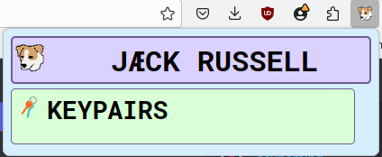

# Jack Russell Extension

This is a browser extension wallet for the Aeternity payment network.  It is
meant to work in the latest versions of Firefox and Chromium.

## Building

Requires [jex](../utils/jex).

```
jex dwim-
```

## How it works

You may want to read about how [AWCP](../libs/awcp/src/awcp.ts) and
[Sidekick](../sidekick/src/sidekick.ts) work first.  Briefly,

- AWCP (Aepp-Waellet Communication Protocol) defines the message protocol
  between a page script (the "aepp") and a wallet (the "waellet"). A page
  script is something that you include with `<script src="./foo/bar.js">`
- Sidekick is a library (for page scripts) of TS/JS function calls that
  blackboxes away all of the stupid implementation detail nonsense about how to
  actually send and recieve the messages defined by AWCP.  For instance, there
  is a function call `tx_sign_noprop`, where you hand that function a
  transaction, and the return value is either the signed transaction or an
  error (for instance, the user rejected the signature request).

JR works in a very similar way to Sidekick, but it has more things that need to
talk to other things layers.  Browser extensions have 3 basic components:

1.  Content scripts.  These are almost the same thing as page scripts.

    In general, content scripts are typically used to modify websites the
    end-user is looking at.  For instance, if you were making RedBorder, an
    extension that adds a 15 pixel wide red border around every image, the
    content script is the part of RedBorder that has the permission to query
    the DOM for `` tags, and modify each such tag to have the property
    `style="border: 15px solid red;"`.

    For the purposes of JR, the content script is simply the messaging layer
    between the page script and the rest of the extension.  All that matters in
    our case is
    - the content script can post messages that are visible to page scripts
    - vice versa
    - the content script has permission to send messages to other parts of our
      extension (and to other extensions and to desktop applictions and it can
      eat your children but that doesn't matter)
    - vice versa

2.  The background script.

    This is the central controller of the application.

3.  Popup scripts.

    This is what a "popup" is in the context of browser extensions:

    

    This is an HTML page like any other.  A popup script is simply a script
    that runs in the context of the popup page.  It has the same basic array of
    permissions as the background script.


```
PAGE SCRIPT  <->  CONTENT SCRIPT  <->  BACKGROUND SCRIPT  <->  POPUP SCRIPT
 Aegora.jp   <->  src/content.ts  <->  src/background.ts  <->  src/popup.ts
```

In JavaScript, the standard way of communicating between mutually opaque
contexts A and B (for instance, between a page script and a wallet) is to write
a class in each context that manages state, which listens for events, and then
does things in response to those events. `ClassA` can dispatch events which are
visible to the event listener in `ClassB` and vice versa.  This is the natural
result of trying to shoehorn concurrency into an object-oriented language.

Sidekick and JR internally work by mimicking Erlang's interprocess
communication (IPC) idiom.

Erlang is a concurrency-first language, and thus has a much saner and more
well-thought-out approach to this problem.  There is a build-in function called
`send(PID, Message)`. The message can be any Erlang term.  In the receiving
process, there is primitive syntax for receiving messages:

```erl
receive
    Pattern1 ->
        do_thing_1();
    Pattern2 ->
        do_thing_2();
    _ ->
        handle_arbitrary_message()
after NMilliseconds ->
    do_timeout_thing()
end.
```

Each process has a mailbox.  When a process enters a `receive`, it sits there
and scans its mailbox to find a message that matches one of the patterns.  If
it finds a message that matches `Pattern1`, it executes the function
`do_thing_1()`, and so on.  The `after` part is optional, and it exists as a
backstop so the process doesn't get stuck in an infinite `receive` loop.

Here is an example of two processes just exchanging ping and pong:

```erl
#!/usr/bin/env escript

-mode(compile).

%% this is the code that is run by the pinger process
pinger() ->
    %% the pinger just sits and waits until a pong message appears in the
    %% mailbox and sends back ping
    receive
        %% wait to receive a pong
        %% only accept this pattern
        {SenderPID, pong} ->
            %% self() gets the current process pid
            %% print out the pong to the console
            ok = io:format("~p received pong from ~p~n", [self(), SenderPID]),
            %% wait for 1 second
            ok = timer:sleep(1000),
            %% send a ping back
            SenderPID ! {self(), ping},
            %% start over
            pinger()
    end.


%% this is the code that is run by the ponger process
%% identical to the pinger except the words "ping" and "pong" have been swapped
ponger() ->
    %% the ponger just sits and waits until a ping message appears in the
    %% mailbox and sends back pong
    receive
        %% wait to receive a ping
        %% only accept this pattern
        {SenderPID, ping} ->
            %% self gets the current process's pid
            %% print out the ping to the console
            ok = io:format("~p received ping from ~p~n", [self(), SenderPID]),
            %% wait for 1 second
            ok = timer:sleep(1000),
            %% send a pong back
            SenderPID ! {self(), pong},
            %% start over
            ponger()
    end.


%% this is the main process
main([]) ->
    %% start up pingers and pongers
    %% these just sit and wait until they are told to do something
    PingerPID = spawn(fun pinger/0),
    PongerPID = spawn(fun ponger/0),
    %% ping the ponger, but lie about who is doing it
    PongerPID ! {PingerPID, ping},
    %% this is a hack so that main doesn't exit and therefore the demo works
    receive
        _ ->
            ok = io:format("bye~n")
    end.
```

```
[~] % escript pingpong.erl
<0.81.0> received ping from <0.80.0>
<0.80.0> received pong from <0.81.0>
<0.81.0> received ping from <0.80.0>
<0.80.0> received pong from <0.81.0>
<0.81.0> received ping from <0.80.0>
<0.80.0> received pong from <0.81.0>
<0.81.0> received ping from <0.80.0>
<0.80.0> received pong from <0.81.0>
^C
```

JR basically thinks of each of the 3 different components of an extension as
Erlang processes, and has some band-aid code to kind of sort of mimick Erlang's
IPC idiom.  Frankly, Erlang's IPC idiom doesn't quite fit into TS/JS, however
even the shoehorned band-aid Erlang idiom is significantly simpler and more
pleasant to work with than the OOPy event idiom.
